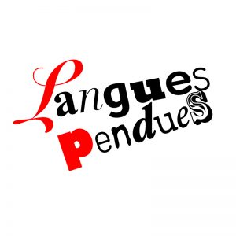



_Interventions poétiques  
Livre d’artiste "Et si je me permettais de briser ces silences"  
18 janvier au 24 février 2024  
Vernissage le jeudi 18 janvier  
Crédit photo : Jean-Michael Seminaro et Éric St-Pierre_

Le livre d’artiste "Et si je me permettais de briser ces silences" est une invitation à se porter à la rencontre, par la poésie et l’art, des tabous entourant le deuil périnatal. Comme un cri lancé à qui voudra bien l’entendre, ces poèmes abordent ce qui demeure immuable et si universel : la mort.  

Myriam Tousignant explore les arts imprimés et la poésie visuelle par le biais d’œuvres sur papier, d’installations et de livres d’artistes. Sa démarche artistique se développe autour d’une conception élargie du portrait comme porte d’entrée pour explorer les concepts d’identité, de filiation et d’histoire familiale. En transformant ou en recontextualisant des matériaux d’archives (textuelles, photographiques) le plus souvent près d’elle, elle développe une pratique sensible qui rend hommage au passé et qui témoigne aussi d’un certain héritage commun ou d’un patrimoine immatériel informant le présent. En ce sens, son travail s’intéresse au passage de l’individuel au collectif par l’entremise d’enjeux sociaux, de pratiques culturelles ou de traditions liés au territoire et à l’histoire du Québec. Ses œuvres possèdent une dimension volontairement nostalgique qui porte sur la commémoration et les affects.

Ce corpus multidisciplinaire a été réalisé dans le cadre du Projet Interventions poétiques au courant de 2023 avec l’appui de l’organisme [Langues pendues](https://languespendues.com/).

---

Book launch "Et si je me permettais de briser ces silences" ("What if I allowed myself to break these silences")

The artist’s book "Et si je me permettais de briser ces silences" ("What if I allowed myself to break these silences") is an invitation to a poetic and artistic encounter aiming to lift the taboo surrounding perinatal bereavement. Crying out to anyone who will listen, its poems tackle the immutable and universal topic of death.

This multidisciplinary body of work was produced throughout 2023 as part of the Interventions poétiques Project and with the support of the [Langues pendues](https://languespendues.com/) organization. 

[Myriam Tousignant (arprim.org)](https://arprim.org/le-magasin/2023-2024/460-myriam-tousignant.html)


  



[Dévoilement d'un livre d'artiste | Productions Langues Pendues](https://languespendues.com/a-la-une/devoilement-livre-artiste/)


  


