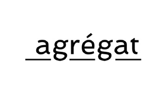

_Exposition collective  "J'habite, les territoires", Édition 2022 de Manifestation JE/US,  
Du 22 septembre au 16 octobre 2022, à l’intérieur et aux alentours de l'Édifice Marcel-Robidas - Maison de la culture à Longueuil._



"Pour beaucoup d'obscurité, quelques éclats"  
Installation  
Carton, foamcore, découpes de livres et journaux

Un foetus se forme. Une vie s’annonce in utero, habitant le territoire des possibles, des rêves, pour tous ceux qui l’attendent et se projettent en un à-venir. Or le territoire reste vide. La vie annoncée se dérobe, transformée en deuil d’un corps en devenir, d'un imaginaire resté en suspens. Par la parole et une économie de moyens, l’artiste vivant ce deuil périnatal raconte. Par collage, assemblage, élagage et le hasard de mots trouvés dans les livres et les journaux, la poésie fait image. L'écriture débute par un cri de douleur sur les réseaux sociaux, une détresse et fragilité à laquelle certains ont réagi, d’autres ont partagé leur histoire. L’artiste génère une conversation autour du vécu d'endeuillés qui isolés, entre malaise et tabou, n’osent prendre leur place. L’expérience intime et solitaire est vécue collectivement - une collection de vides. Suivant un processus itératif d’engagement et de médiation, le projet est voué à s’élargir : englobant livre d’artiste, ateliers de création et installation.



  

