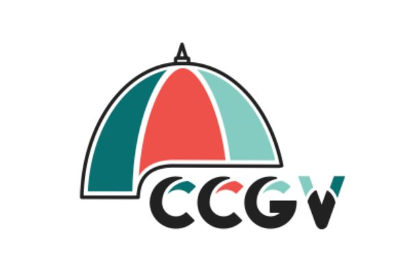

_Atelier de poésie visuelle et création d’un fanzine  
Animatrice : Myriam Tousignant  
CCGV, Centre Culturel Georges-Vanier_

_Série de 3 ateliers  
octobre - novembre 2021_

Lien site web: [Poésie visuelle et création d’un fanzine (ccgv.ca)](https://www.ccgv.ca/formation/poesie-visuelle-et-creation-dun-fanzine/)

Cette série de trois ateliers créatifs a été offerte à l’automne 2021 au Centre Culturel Georges-Vanier à Montréal. Les participantes ont eu l’occasion de découvrir l’univers créatif de la poésie visuelle et des fanzines en créant leur propre petite publication.

L’objectif était de se familiariser à cet univers qui combine les arts visuels à la littérature, en plus de découvrir des artistes et poètes afin de stimuler la créativité.

Une poésie engagée et libre a pu émerger du réemploi des journaux et de textes imprimés par les participantes.

Ces rencontres ont été l’occasion unique de découvrir différentes stratégies d’écriture visuelles. Des échanges entre les participants y ont été encouragés afin de stimuler un sentiment de communauté basé sur le respect. Cinq fabuleux fanzines ont été à partir d’une sélection de textes produits au cours des ateliers : « Le jardin » de Véronique Leduc, « Ma mère No5 » de Ellie Chartier, « Violences achevées de Marie Claude Senécal, « Simple passion » de Andrée Labelle et un fanzine commun « Duras obscurcie ».

Un lancement au printemps 2022 est prévu, comprenant les fanzines des deux cohortes de l’année au CCGV.



  

