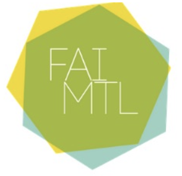

_Atelier Fanzine - Zocalo  
Vendredi 22 mars 2019 de 14h à 17h  
Zocalo  
Par l’artiste Myriam Tousignant_

L’artiste multidisciplinaire, Myriam Tousignant a réalisé au mois de mars 2019 un atelier de fanzines au centre d’artistes en art imprimé Zocalo. Inspiré de la forme d’expression du Blackout poetry ou poésie par soustraction, les participant.e.s ont réemployé le journal comme matériau de base pour la création de courtes phrases percutantes. Ces poèmes, ainsi créés ont été assemblés afin d’élaborer une narration ouverte et engagée. Les poèmes produits ont servi à créer 2 livres accordéon, #moiaussi et les racines enfouies, imprimés en 250 exemplaires. De plus, une illustration originale en lien avec le contenu des poèmes a été produite par l’artiste Mélodie Vachon Boucher, autrice de bandes dessinées et illustratrice féministe. 



  





  


