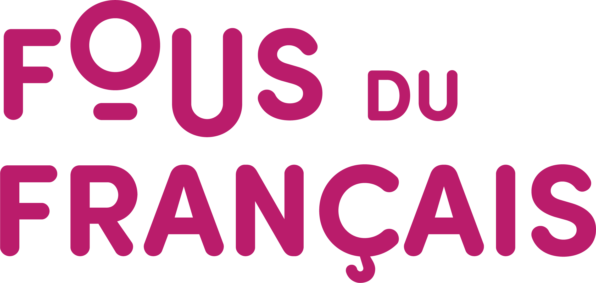


 
_Projet de médiation culturelle « De nos regards et de nos voix, on fera de la fournache »  
Bibliothèque Maisonneuve   
Médiatrice culturelle et coordination de projet : Myriam Tousignant  
Artistes invités : Benoit Bordeleau, Mériol Lehmann, Stéphanie Nuckle  
Mention de source : Louis-Étienne Doré, Mélanie Dusseault, Mériol Lehmann et Myriam Tousignant_

 « De nos regards et de nos voix, on fera de la fournache » est un projet de médiation culturelle initié par la bibliothèque Maisonneuve. Le projet s’est déroulé de l’automne 2023 à l’hiver 2024 avec des groupes du primaire et du secondaire, des étudiantes et étudiants de l’entreprise d’insertion Le Boulot vers… ainsi qu’avec des usagers et usagères de la bibliothèque Maisonneuve. 

Dans un premier temps, les personnes participantes ont été invitées à déambuler dans les ruelles à proximité de la bibliothèque afin d’aller à la rencontre d’un territoire familier, de s’y rendre disponibles et curieuses. Ensemble, elles ont capté ce qui se réensauvage dans un fragment urbain donné sous la forme de notes écrites, de photographies et d’objets divers et hétéroclites recueillis au fil du parcours, le tout afin de mettre en lumière une nature qui discrètement reprend ses droits. Dans un deuxième temps, des ateliers d’écriture et de photographie ont permis d’entrevoir autrement ces matériaux, de les associer et de les assembler en vue de créer des liens inédits, voire imaginaires. Ces matériaux sont ensuite entrés dans la confection de fanzines, publications artisanales qui sont disponibles pour le prêt à la bibliothèque Maisonneuve. 

De cette démarche de collecte et de déambulation sont nées des œuvres collectives qui ont été exposées à la bibliothèque Maisonneuve du 11 avril au 20 septembre 2024. Grâce à une collaboration avec L’imprimerie centre d’artistes et la maison de la culture Maisonneuve, des expositions satellites ont été présentées à la Vitrine de L’imprimerie centre d’artistes du 1er au 30 avril 2024 et à la place des Tisserandes dès le 30 avril 2024. 

L’objectif de ce projet étant de renouveler notre regard sur la présence de la nature en ville, sur la place qu’elle occupe dans nos vies et la manière dont elle entre en tension avec une culture locale. Il a donc fallu user de stratégies pour voir autrement : s’étendre sur l’asphalte, observer le ciel traversé de branches et de fils de toutes sortes, poser l’oreille sur la brique afin de percevoir les vibrations du quartier, chercher ce qui pouvait bien se cacher dans les broussailles pour y trouver les traces de vécus aussi divers qu’étrangers. Surtout, nous avons accepté, ensemble, de ralentir. Nous nous sommes permis d’imaginer ce que ces traces avaient à révéler sur nous, sur nos sensibilités multiples, et sur le monde discret qui nous entoure. Tout cela, l’espace de quelques mois, a été notre fournache. 

Pour la réalisation de ce projet, l’aide financière Fous du français a été accordée par l’Union des municipalités du Québec et le gouvernement du Québec. 

*Fournache. n. f. Agric. Tas d’herbes, de racines et de feuilles mortes qu’on brûle dans les champs pour en faire de l’engrais (Dictionnaire des mots rares et précieux).  





    





