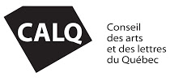

Le projet multidisciplinaire Petites mains est né pour donner suite à la découverte des archives personnelles de ma grand-mère maternelle, Réjanne Martin, décédée à l’âge de 94 ans. Ces documents témoignent des nombreux changements survenus lors du siècle dernier et font écho à des enjeux récemment soulevés comme la place qu’occupent les aînés au sein de la société québécoise.

Depuis plusieurs mois, je développe une correspondance avec des femmes âgées de plus de 65 ans dans le but de découvrir leur parcours de vie et de collecter des images provenant de leur archive personnelle. Les sujets de la maternité, de l’enfance et du mariage font partie des thèmes qui ont été abordés jusqu’à présent. Les nombreuses photographies qui m’ont été partagées me permettent de développer une nouvelle série de dessins. Ces dessins sont par la suite numérisés puis imprimés pour la création de tissages de papier.

Au cours des prochains mois, j’entends également mener des entretiens auprès de ces femmes. L’objectif est de pouvoir éventuellement créer des capsules audios utilisées dans le cadre de ce projet comme élément de narration. La mise en ligne de ces capsules est prévue sur un site d’hébergement de podcast comme celui de Podbean et sur mon site personnel (à venir lors de la phase deux du projet). Une expérience immersive sous la forme d’une installation regroupant la diffusion des œuvres audio et des œuvres visuelles est prévue à la fin de ce cycle de création.

Mon objectif est qu'il émerge de ce processus des portraits de femmes intéressants qui témoignent de leur identité culturelle commune et convoque à vivre une expérience artistique. En terminant, je tiens à remercier le Conseil des arts et des lettres du Québec de son appui financier.

